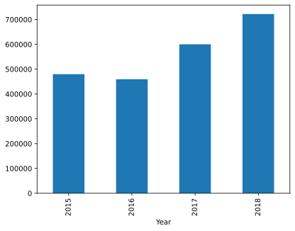
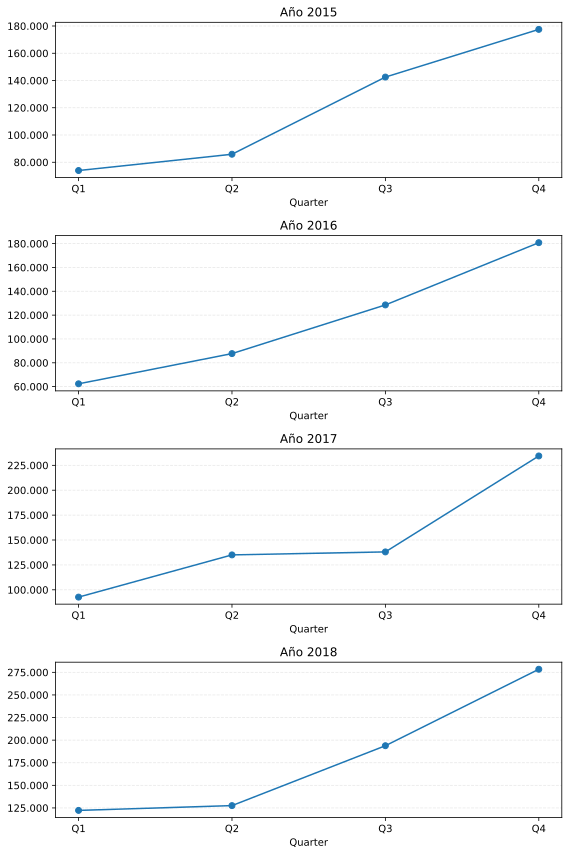

# Análisis Temporal de Ventas – Dataset de Hipermercado

## 📌 Contexto
Este proyecto analiza el comportamiento de las ventas de un hipermercado
desde una perspectiva temporal, con foco en la estacionalidad y la
volatilidad trimestral.

El objetivo no es únicamente describir el histórico, sino evaluar si la
estructura de los datos permite realizar proyecciones confiables a nivel
trimestral.

---

## 🎯 Objetivo del análisis
- Identificar patrones de estacionalidad en las ventas
- Analizar la participación de cada trimestre en el total anual
- Evaluar la volatilidad y el crecimiento interanual
- Explorar la viabilidad de modelos predictivos simples

---

## 🛠️ Herramientas utilizadas
- Python
- Pandas
- NumPy
- Matplotlib
- Scikit-learn

---

## 📊 Principales análisis realizados

### Ventas por año
Se observa del registro de los cuatro años que, la facturacion del ultimo año 2018 es el de mayor ingreso dentro del historico, con un aumento del 20.3 % en comparacion con el año 2017.

---
### Ventas por trimestre
Se observa una concentración de ventas hacia el Q4, especialmente en los
últimos años del período analizado, lo que evidencia una fuerte
estacionalidad.

---

### Participación porcentual trimestral
El análisis porcentual muestra que el Q4 representa cerca del 40% de las
ventas anuales en varios años, mientras que el Q1 mantiene una participación
menor pero creciente.

---

### Volatilidad y crecimiento interanual
Se analizó la variación porcentual de ventas entre trimestres consecutivos,
detectando una alta volatilidad, especialmente en las transiciones hacia el
Q4.

---

## Intento de modelado predictivo
Se probaron modelos de regresión lineal y Random Forest para predecir ventas
trimestrales.

Aunque los modelos lograron capturar parcialmente la estacionalidad, las
métricas obtenidas (MAE elevado y R² moderado) indican que:

- La alta volatilidad del negocio
- La baja cantidad de observaciones trimestrales

limitan la capacidad predictiva de modelos supervisados tradicionales.

Por este motivo, el modelado no se considera robusto para un escenario real
de negocio.

---

## ✅ Conclusiones
- Existe una estacionalidad clara con fuerte dependencia del Q4
- El Q1 muestra un crecimiento sostenido año a año
- La volatilidad trimestral dificulta proyecciones confiables
- En este contexto, el análisis exploratorio aporta más valor que el
  modelado predictivo

---

## 📁 Notebook
El análisis completo puede encontrarse en:

➡️ `./Notebook/VentasTemporalidad.ipynb`
