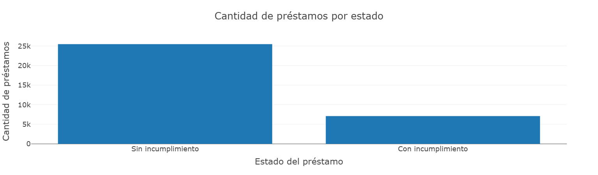
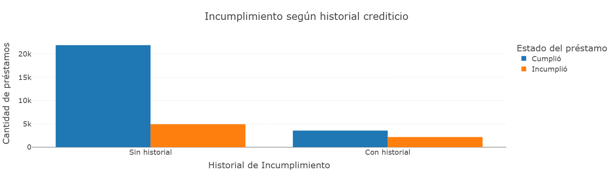
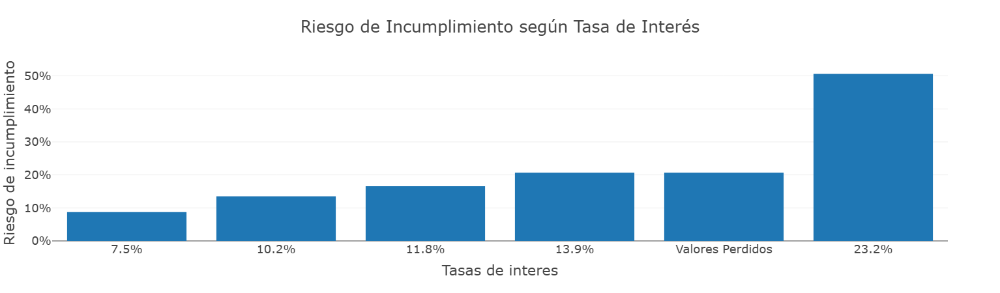
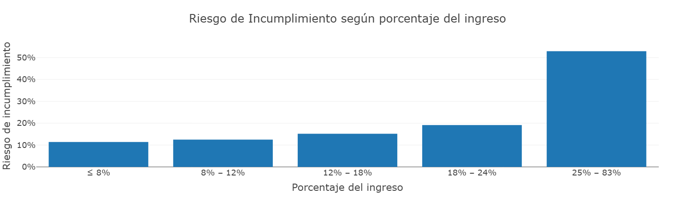
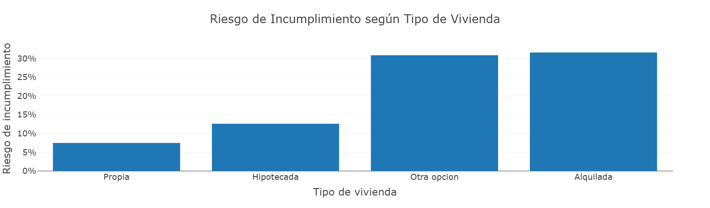

# 💳 Modelo Predictivo de Riesgo Crediticio

## 📌 Contexto

Este proyecto desarrolla un análisis exploratorio y un modelo predictivo para estimar la probabilidad de incumplimiento de préstamos, utilizando un dataset estructurado con información demográfica, financiera y crediticia de los solicitantes.

El objetivo es identificar los principales factores asociados al default y construir un modelo capaz de discriminar entre clientes de alto y bajo riesgo.

---

## 🌐 Visualización Interactiva

El proyecto cuenta con la libreria plotly que permite explorar los gráficos de segmentación de riesgo de manera dinámica.

👉 Para visualizarlos se debe descargar el notebook:

**🔗 https://github.com/alvarezjp/PortafolioDataScience/blob/main/03-RiesgoCrediticio/Notebook/03-Credit.ipynb**

> La versión interactiva incluye análisis por tasa de interés, porcentaje de ingreso, historial crediticio y tipo de vivienda.

---

## 🎯 Objetivos del Proyecto

- Analizar los principales drivers del incumplimiento crediticio
- Detectar inconsistencias y limpiar el dataset
- Segmentar el riesgo por variables clave
- Construir un modelo predictivo de clasificación
- Evaluar desempeño mediante métricas robustas

---

## 🛠️ Herramientas Utilizadas

- Python  
- Pandas  
- NumPy  
- Matplotlib  
- Plotly  
- Scikit-learn  
- XGBoost  

---

## 🧹 Preparación y Calidad de Datos

Durante el análisis exploratorio se realizaron las siguientes acciones:

- Eliminación de edades no realistas (valores extremos inconsistentes).
- Eliminación de registros donde la antigüedad laboral superaba la edad.
- Tratamiento de valores nulos en variables relevantes.
- Codificación One-Hot para variables categóricas.
- División estratificada Train/Test.

Estas acciones permitieron asegurar coherencia lógica y estabilidad en el modelado.

---

## 📊 Principales Hallazgos del Análisis Exploratorio

### 📈 Distribución del Estado del Préstamo

El 78% de los clientes cumplieron con su obligación crediticia, mientras que aproximadamente el 22% incurrió en incumplimiento.

---

### 📊 Riesgo según Historial Crediticio

Los clientes con historial previo de incumplimiento presentan aproximadamente el doble de riesgo respecto a aquellos sin antecedentes.

---

### 💰 Riesgo según Tasa de Interés

Se observa una relación positiva clara: a mayor tasa de interés, mayor probabilidad de incumplimiento.

---

### 📉 Riesgo según Porcentaje del Ingreso

Los clientes que destinan más del 25% de su ingreso al préstamo presentan las tasas más altas de default, superando el 50% en el segmento superior.

---

### 🏠 Riesgo según Tipo de Vivienda

Los propietarios presentan la menor tasa de incumplimiento, mientras que los arrendatarios muestran niveles significativamente más altos.

---

## 🤖 Modelo Predictivo

Se implementó un modelo **XGBoost Classifier**, optimizado mediante RandomizedSearchCV utilizando ROC-AUC como métrica principal.

### 📌 Desempeño del Modelo

- **ROC-AUC Validación Cruzada:** ~0.95  
- **ROC-AUC Test:** ~0.95  
- Excelente capacidad discriminativa  
- Baja diferencia entre train y test (buena generalización)

### 📊 Métricas de Clasificación (Umbral 0.5)

- Precisión clase incumplimiento: 96%
- Recall clase incumplimiento: 72%
- Accuracy global: 93%

El modelo logra identificar correctamente la mayoría de los clientes de alto riesgo, con margen de ajuste del umbral según la estrategia del negocio.

---

## 📌 Conclusiones

- El riesgo crediticio está fuertemente asociado a:
  - Carga financiera relativa
  - Historial de incumplimiento
  - Tasa aplicada
  - Estabilidad laboral
  - Tipo de vivienda

- El modelo presenta alto poder predictivo (AUC ≈ 0.95).
- Puede utilizarse como herramienta de apoyo en la toma de decisiones crediticias.
- Permite segmentar clientes, ajustar tasas y optimizar gestión de riesgo.

---

## 📁 Estructura del Proyecto

    PortafolioDataScience/
    │
    ├── Notebook/
    │   └── credit_risk_analysis.ipynb
    │
    ├── Data/
    │   └── credit_risk_dataset.csv
    │
    ├── Images/
    │   └── (gráficos utilizados en este README)
    │
    └── README.md

---

## 📌 Notebook Completo

El análisis detallado y el modelado completo se encuentran en:

➡️ `./Notebook/credit_risk_analysis.ipynb`